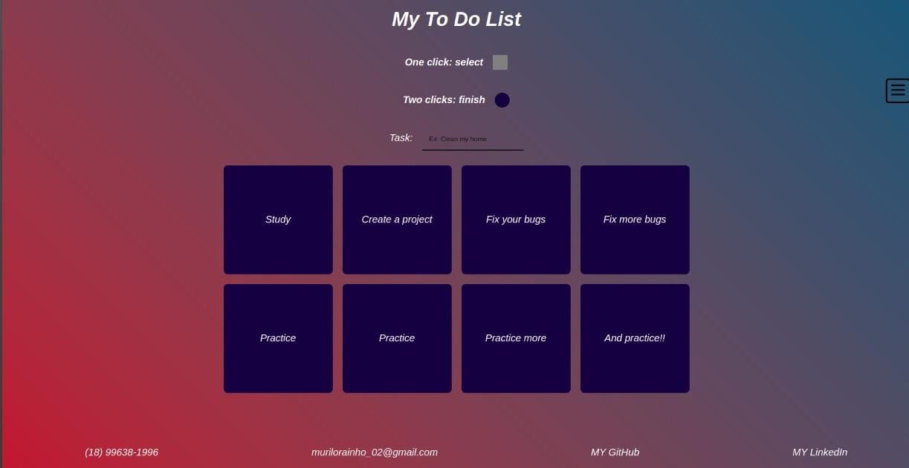

# To Do List Project

### (Constantly changing project)

---

---

## About project

[Project's Page](https://murilo-rainho.github.io/to-do-list/)

This project was made during my first week in the second month on the Trybe Course. Me, without knowledge before the course, **with two month of course**, was able to use some basic knowledge about HTML, CSS and JavaScript.

---

### what is the site for?

Basically you can put your to-do list so you can organize between projects that have already been done, those that still need to be done, and the to-do you are currently working on.

---

### HTML

In the HTML, I used simple things like semantic HTML and a `head` to use futurelly responsivity

---

### CSS

In the CSS, I used basic knowledges like:
* `display: flex;`
* `background-image: linear-gradient();`
* `transition:`
* `@media screen`
* Pseudo-class
* placeholder styling

Moreover, I hadn't yet learned how to create a menu button, so I used my creativity and little knowledge and google research to create a menu button my way...

---

### JavaScript

With JS, I basically just used `addEventListener` to create buttons to interact with the **to do list**.

---
